<div align="center">


<br/>

[](https://tryboy869.github.io/gitsearch)
[](LICENSE)
[](https://tryboy869.github.io/gitsearch)
[](CONTRIBUTING.md)
[](https://www.w3.org/WAI/WCAG21/quickref/)
[](#)

**Moteur de recherche sémantique pour GitHub.**  
Trouve les repos que le moteur natif GitHub ne trouve pas.

[🔍 Rechercher](https://tryboy869.github.io/gitsearch) • [📊 Dashboard](https://tryboy869.github.io/gitsearch/dashboard.html) • [⚙️ Settings](https://tryboy869.github.io/gitsearch/settings.html)

</div>

---

## 🌌 Le problème

Le moteur de recherche natif GitHub est **cassé pour la découverte sémantique**.

Tu cherches "moteurs de bases de données distribués en Rust" — il te retourne des repos qui ont ces mots dans leur nom, pas dans leur domaine réel. Il n'y a **aucune expansion sémantique**, aucune compréhension des synonymes, aucune hiérarchie de domaines.

GITSEARCH règle ce problème.

---

## ✦ Ce que fait GITSEARCH

```
Tu écris : "machine learning rust async"
              ↓
GITSEARCH normalise :
  machine learning → topic:machine-learning OR topic:deep-learning OR topic:neural-network OR topic:ml
  rust             → language:Rust
  async            → topic:async OR topic:asynchronous OR topic:concurrency OR topic:tokio
              ↓
GitHub Search API : multi-topics, fusionné, re-ranked
              ↓
Résultats pertinents — pas juste des correspondances de mots
```

**Fonctionnalités :**

- 🔍 **Expansion sémantique automatique** — 50+ mappings de synonymes → topics officiels GitHub
- 🏷 **Tags GITSEARCH** — convention `<!-- gitsearch: tag1, tag2 -->` dans les READMEs
- 📡 **GitHub API live** — zéro backend, zéro latence serveur
- 🗂 **13 domaines** — sidebar avec filtrage par domaine technologique
- 💾 **Historique persistant** — IndexedDB local, jamais envoyé à un serveur
- 📊 **Dashboard live** — métriques de l'écosystème, trending, distribution langages
- ⚙️ **Token GitHub optionnel** — 60 req/h sans token → 5 000 req/h avec token
- ♿ **WCAG 2.1 AA** — `prefers-reduced-motion` sur toutes les animations SVG

---

## 🚀 Utilisation

**Aucune installation requise.** Ouvrez simplement :

👉 **[tryboy869.github.io/gitsearch](https://tryboy869.github.io/gitsearch)**

Pour un accès étendu (5000 req/h au lieu de 60) :
1. Allez dans [Settings](https://tryboy869.github.io/gitsearch/settings.html)
2. Créez un [GitHub PAT](https://github.com/settings/tokens/new?scopes=public_repo,read:user&description=GITSEARCH) avec les scopes `public_repo` + `read:user`
3. Saisissez votre username + token → Sauvegarder

---

## ✦ Indexer votre repo

Faites partie de l'écosystème GITSEARCH en **2 étapes** :

### Étape 1 — Badge d'appartenance

Ajoutez dans votre `README.md` :

```markdown
[](https://tryboy869.github.io/gitsearch)
```

Aperçu : [](https://tryboy869.github.io/gitsearch)

### Étape 2 — Tags sémantiques

```markdown
<!-- gitsearch: machine-learning, python, transformer, nlp, benchmark -->
```

Ce commentaire est **invisible dans le README rendu** mais lu par le moteur de recherche. Jusqu'à 10 tags.

### Étape 3 — Topic GitHub

Dans votre repo → **Settings → Topics** → ajoutez `gitsearch`.

---

## 🏗 Architecture

```
gitsearch/
├── index.html          ← Moteur de recherche (page principale)
├── dashboard.html      ← Dashboard métriques écosystème
├── settings.html       ← Configuration token GitHub + préférences
├── assets/
│   ├── logo.svg        ← Logo animé (loupe + texte typewriter)
│   ├── creator-card.svg← Carte créateur animée
│   ├── footer.svg      ← Footer animé
│   └── badges/
│       ├── badge-indexed.svg  ← Badge appartenance (à embarquer)
│       └── badge-tags.svg     ← Badge tags (template)
├── scripts/
│   └── release.sh      ← Script de release automatique
├── .github/workflows/
│   ├── release.yml     ← Auto-release depuis CHANGELOG
│   └── pages.yml       ← Déploiement GitHub Pages
├── CHANGELOG.md
├── CONTRIBUTING.md
├── CODE_OF_CONDUCT.md
├── LICENSE             ← MIT
├── sitemap.xml
└── robots.txt
```

**Principes :**
- 100% client-side — aucun serveur, aucune base de données
- Données locales uniquement — IndexedDB, jamais envoyées
- Zéro dépendance npm — Tailwind CSS via CDN, pure vanilla JS
- SVG SMIL — animations sans JavaScript, WCAG compliant

---

## 📊 Dashboard

Le [Dashboard](https://tryboy869.github.io/gitsearch/dashboard.html) affiche :
- Repos indexés avec le badge GITSEARCH
- Trending repos de la semaine
- Distribution des langages
- Popularité des domaines technologiques
- Votre profil GitHub (si connecté)
- Historique de vos repos visités

---

## 🤝 Contribuer

Voir [CONTRIBUTING.md](CONTRIBUTING.md) pour les détails.

**Contributions rapides :**
- Ajouter des synonymes dans `SEMANTIC_MAP` (index.html)
- Soumettre de nouveaux domaines dans `DOMAINS`
- Indexer votre propre repo avec les badges

---

## 🗺 Roadmap

- [x] **v1.0** — Moteur sémantique, 3 pages, badges SVG, dashboard live
- [ ] **v1.1** — Recherche dans le contenu README (GitHub Code Search API)
- [ ] **v1.2** — Filtres combinés (domaine + langage + étoiles + date)
- [ ] **v1.3** — Export des résultats (JSON / CSV)
- [ ] **v2.0** — Cloudflare Worker pour stats de vues des badges
- [ ] **v2.1** — Console développeur avec métriques par repo

---

## 👤 Créateur

<div align="center">

</div>

---

## 📝 Licence

MIT — voir [LICENSE](LICENSE)

---

<div align="center">

</div>
